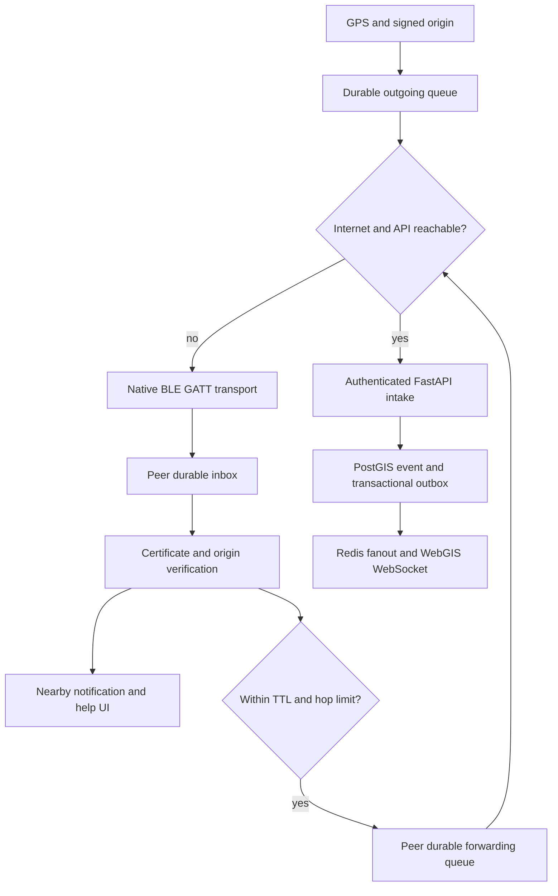

# SOS integration boundaries

The origin signature covers immutable identity, event ID, coordinates, timestamp, message, TTL and hop limit. Relay hops and routing metadata are mutable. Persist before native inbox acknowledgement; failed uploads remain queued. The server is authoritative for duplicate detection, responder registration and cancellation. Module boundaries allow teams to replace identity UI, GIS display or transport without changing the SOS contract.

Wire framing: `SK` magic, version 2, big-endian uint16 sequence, uint16 total frame count, uint8 chunk length, then 1–12 payload bytes. The complete UTF-8 JSON packet is capped at 16384 bytes. A reader accepts only contiguous frames with a constant frame count. Each server snapshots the packet per central for the duration of the read; queued advertisements rotate every ten seconds. A transfer is abandoned after 60 seconds. This is best-effort store-and-forward; there is no radio delivery SLA or mesh cancellation acknowledgement.
